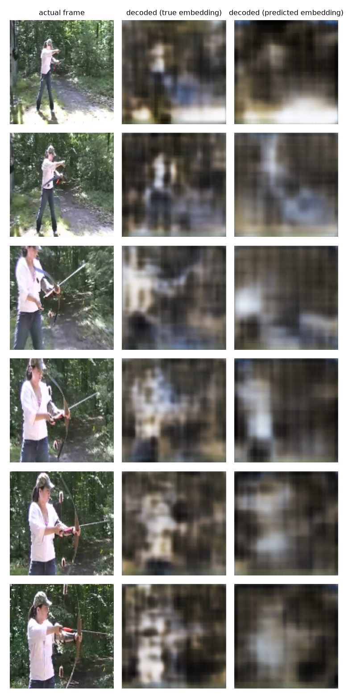

# MiniGrid → JEPA: Phase 1, dynamics-rich environment + pilot video corpus

A small JEPA-style video representation model, inspired by V-JEPA/V-JEPA 2
but trained from scratch, on video generated by a controlled environment
rather than internet video. Full plan: [docs/phase1-plan.md](docs/phase1-plan.md).

This is a different project from [`ai-build-and-learn/topics/v-jepa`](../ai-build-and-learn/topics/v-jepa):
that one probes a **pretrained** V-JEPA 2 checkpoint on Kinetics clips.
This one trains a small JEPA-style model **from scratch** on
**procedurally generated** video, and the model itself is a later phase
(see "Explicitly out of scope" in the plan) -- what's here is the
environment and the pilot dataset.

**Second iteration.** The first pass used MiniWorld's `OneRoom` (first-
person 3D, empty room, camera-motion only). That turned out to be the
wrong substrate: the only thing that ever changed was the camera's own
pose, which doesn't exercise anything close to what action-conditioned
post-training (V-JEPA-2-AC style) needs -- an action has to visibly change
the *state of the world*, not just the viewpoint. Replaced with a custom
[MiniGrid](https://github.com/Farama-Foundation/Minigrid) environment (2D
top-down grid, same Farama family as MiniWorld) purpose-built for two
dynamics classes: obstacles that move independent of the agent's own
actions, and actions whose effect is state-dependent (a locked door that
only opens if you're carrying the matching key; walking into a wall,
obstacle, or locked door blocks the move instead of ending the episode).
Reasoning and what was verified before committing to the swap is in
[docs/phase1-plan.md](docs/phase1-plan.md).

## What's here

```
env_wrapper/    MiniGridJepaEnv: split-room + locked door/key + goal +
                independently-moving obstacles, randomized per episode
data_gen/       episode generation, overlapping clip extraction, storage
scripts/        smoke_test.py, generate_pilot.py, inspect_dataset.py
```

The model never sees anything in `env_wrapper`/`data_gen` beyond raw
frames -- position/orientation/goal/door/obstacle/action metadata is
recorded (`meta.json` per episode) for evaluation only.

## Setup

MiniGrid renders headless via `SDL_VIDEODRIVER=dummy` (set in
`env_wrapper/wrapper.py` before minigrid/pygame is imported) -- no Xvfb, no
system GL packages needed, unlike the MiniWorld-based first pass.

```bash
conda create -n miniworld python=3.11
conda activate miniworld
pip install -r requirements.txt

python scripts/smoke_test.py                                     # proves rendering + dynamics work
python scripts/generate_pilot.py --n-episodes 500 --episode-len 100
python scripts/inspect_dataset.py --dataset-dir dataset/pilot
```

## Pilot results (2026-09-16)

500 episodes, 61.6s wall-clock, 19.8 MB on disk. Dynamics actually landed
in the recorded data, not just in a hand-picked demo run: key picked up in
97% of episodes, door opened in 84%, independently-moving obstacles in
**100%**, at least one blocked move (wall/obstacle/locked-door) in 93%,
goal actually reached within the 100-step budget in 54%. Contact sheet at
`dataset/pilot/contact_sheet.png` (gitignored, regenerate with
`inspect_dataset.py`). Details in [notes/journal.md](notes/journal.md)
(gitignored, ask if you want the contents).

## Phase 2 pilot-scale run (2026-09-16)

First model: a small plain V-JEPA-style encoder/predictor (no action
conditioning yet -- see [docs/phase2-plan.md](docs/phase2-plan.md)),
trained on this GPU box on the regenerated 500-episode pilot (3570 train /
419 val clips, 16-frame clips, 2.67M-param ViT encoder). Masked-prediction
loss trains cleanly and doesn't collapse (embedding std keeps growing, not
shrinking), but the linear probe this plan set as the actual bar -- does
the trained encoder beat a random-init encoder of the same shape at
predicting the agent's grid position from a frozen, mean-pooled embedding
-- **was not met**: trained MSE 2.30 vs. random-init 0.65 on the best
checkpoint (was 26.66 vs. 1.33 before fixing an overly aggressive learning
rate). Full numbers and the leading hypotheses (undetermined which
dominates: scale, mean-pooling diluting local signal, or the objective
favoring scene appearance over agent state) are in
[docs/phase2-plan.md](docs/phase2-plan.md)'s Results section.

## Scale-up to 5,000 episodes (2026-09-16)

Regenerated a 10x larger corpus (`dataset/scale5k/`, dynamics stats
matched the pilot) and retrained the same model on it. Along the way,
`model/dataset.py` needed a real fix -- it decoded the whole corpus into
RAM, which fit at pilot scale (~1.9GB) but not at 5000 episodes (~19GB,
more than this box's 15GB total RAM); rewrote it to stream in shuffled
chunks with bounded memory, and parallelized decode across CPU cores to
keep it from becoming the bottleneck. See
[docs/phase2-plan.md](docs/phase2-plan.md) for the full story, including a
drift pattern in training that now looks structural (shows up regardless
of lr or data scale) rather than a one-off tuning mistake.

Linear-probe result: **trained encoder MSE 1.08 vs. random-init 0.55 --
still worse, but the gap closed from 3.5x (500 episodes) to 2x (5,000
episodes)**. The gap closing as data scales up is itself a real signal,
even though this run still doesn't clear the bar. Doesn't yet separate
"needs more data" from "needs more training/bigger model" as the
dominant lever.

## Decisive experiment: is this a scale problem or a task problem? (2026-09-17)

Before scaling data further, we needed to know whether the from-scratch
model's failure meant "this task has no learnable signal at this
resolution/domain" or just "our particular model/data is too small." The
test: load Meta's real pretrained V-JEPA2.1 ViT-B/16 encoder with **zero
training**, and compare it zero-shot against a random-init encoder of the
same architecture, both frozen, both probed the same way. Pretrained beat
random-init clearly on MiniGrid (0.19 vs. 0.56 MSE) -- proof the domain
does carry decodable signal, and our from-scratch attempt was undertrained
at this scale, not fundamentally broken. This reframed the plan: rather
than keep scaling a from-scratch model, fine-tune the real pretrained
encoder instead (`model/pretrained_jepa.py`, `model/finetune.py`) --
catastrophic forgetting during fine-tuning was fixed with split learning
rates (encoder at 0.05x the predictor's LR).

## Pivot to a 3D car-navigation environment (2026-09-17)

Switched the data domain from MiniGrid to
[`Car-Navigation-Env`](../Car-Navigation-Env) (Panda3D, first-person 3D,
kinematic-bicycle car model) -- once a real pretrained encoder was in
play, domain similarity to V-JEPA's natural-video pretraining mattered
more than any from-scratch-specific design criteria, and a 3D environment
supports better visualization/demo material. Three real bugs were found
and fixed in that repo along the way (not guessed workarounds -- each
root-caused with direct evidence): a vehicle mesh anisotropic-scaling bug
that misplaced cars visually without affecting actual collision math, a
Panda3D memory leak (worked around by looping short-lived generation
processes instead of one long-running one), and headless GPU rendering
(this box has no display; fixed via Panda3D's EGL-backed `p3headlessgl`
module instead of falling back to software rendering). A 10k-episode,
10-process-parallel corpus (`dataset/carnav_pilot/`) was generated for
fine-tuning.

Fine-tuning the real encoder+predictor jointly on car-nav data completed
cleanly (10 epochs, no crash) but came out **worse** than the untouched
zero-shot pretrained encoder on the position probe (MSE 3164.7 fine-tuned
vs. 2912.5 zero-shot pretrained, vs. 3742.8 true random-init) -- loss
plateaued after ~2 epochs and never recovered as the LR schedule decayed.
Likely a training-recipe/schedule issue rather than anything fundamental,
but given the time remaining in this phase we didn't chase a fix further:
**the zero-shot pretrained encoder, untouched, was the best asset we had**,
and we moved on to testing the deeper claim directly with it instead of
continuing to debug our own fine-tune.

Visualization tooling for this stage (`model/visualize_embeddings.py`,
`model/decoder.py` + `model/train_decoder.py`, `model/visualize_prediction.py`)
and a Phase 3 action-conditioned predictor design (`model/ac_predictor.py`,
`model/ac_dataset.py`, matching V-JEPA2-AC's block-causal
action/state-token scheme) were built and verified but not run against
real training -- deferred, not abandoned.

## Real-video predictor demo: does V-JEPA2's actual predictor work? (2026-09-18)

A late discovery: the checkpoint we'd been loading (`ema_encoder` key
only, this whole project) also contains **Meta's own predictor** --
trained jointly with the encoder on real video (Kinetics/SSV2/HowTo100M)
for 40 epochs at world_size=512 -- that had never actually been used.
Rather than keep debugging our own undertrained predictor on synthetic
car-nav renders, `model/demo_realvideo.py` tests Meta's real predictor
directly, with **no training of either the encoder or predictor**, on a
small real-video sample
([Kinetics-mini](https://huggingface.co/datasets/nateraw/kinetics-mini),
~100 clips across 5 action classes, `scripts/download_kinetics_mini.sh`)
-- matching the actual domain the predictor was trained on. The
predictor's output lives in a separate 1664-dim "teacher" space, not the
encoder's own 768-dim space (`src/hub/backbones.py`'s
`vjepa2_1_teacher_embed_dim` in the reference repo), so a small pixel
decoder (the only thing actually trained here, a few minutes on ~100
clips) is needed per representation space just to *see* the result --
JEPA itself never decodes to pixels.

**v1 failed outright**: masking the entire last temporal tubelet as one
solid block (`predict the whole future frame`) produced an unrecognizable
checkerboard blob (`docs/figures/prediction_demo_realvideo_v1_wholeframe.png`).
Not because the predictor is bad -- V-JEPA2.1's actual training config
(`configs/train_2_1/vitb16/pretrain-256px-16f.yaml` in the reference repo)
masks several small *scattered* spatial blocks spanning the clip's full
duration, never one whole future frame. We'd tested it on a task shape it
had never seen.

**v2/v3 fixed the task shape**: switched to `model.jepa.MultiBlockMask`
(scattered blocks, matching the real training distribution), and
reconstructed the last frame's token grid by combining the predictor's
teacher-space prediction for masked cells with its teacher-space
projection of visible cells (`predictor_proj_context`) for the rest. With
enough decoder training (v3, cosine LR schedule, best-checkpoint restore):



The predicted-embedding column (right) closely tracks the true-embedding
column (middle) -- same dark speckled forest texture, same light blob
where the person/bow stands, same tan path region -- built entirely from
context, never having seen this frame's actual pixels.

**Honest scope of this result**: this validates the JEPA *idea* using
Meta's reference-scale weights exactly as released, on real video. It
does **not** show that our own from-scratch or fine-tuned attempts (on
the synthetic car-nav domain) reached comparable quality -- they didn't.
The lesson that generalizes past this project: a predictor's competence is
inseparable from the exact task distribution it was trained on --
"doesn't work" and "wrong test" look identical from the outside, and are
easy to conflate.

## Next

Not yet decided: fix the car-nav fine-tuning recipe (the LR-schedule/
plateau issue) now that zero-shot vs. fine-tuned vs. random-init are all
separately measured, revisit Phase 3 AC training on car-nav now that a
real predictor's task-sensitivity is understood, or treat the real-video
demo as the project's headline result and stop here. Appearance/
structural holdout splits remain deliberately deferred past this.
